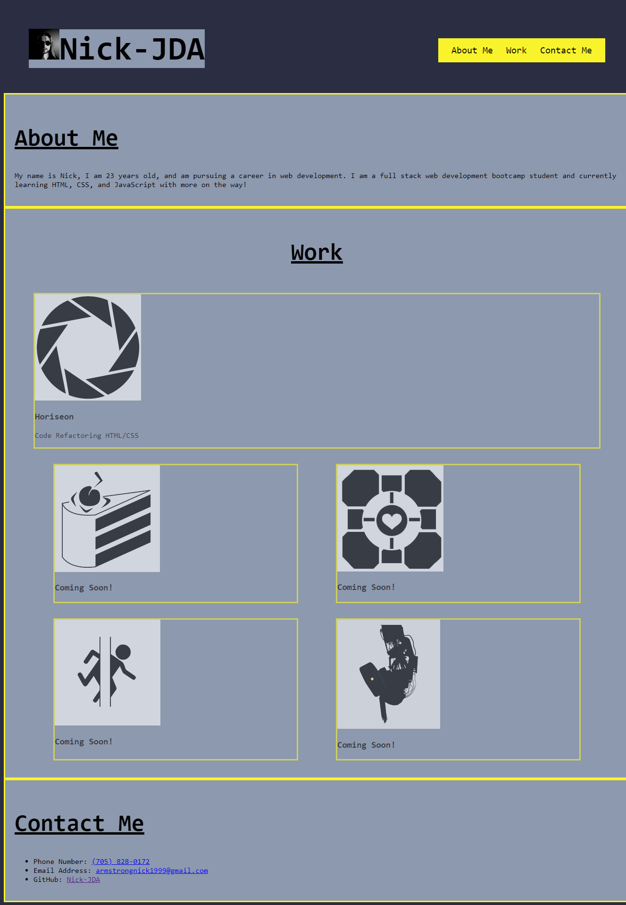

# Portfolio-page-Nick-JDA
Portfolio web application

## Description

This project is a portfolio web application for potential employers to view. This webpage will allow employers to see my current completed projects that are deployed to guage my skillset and contact me through multiple outlets.

Deployed Application URL: https://nick-jda.github.io/Portfolio-01/ 

## Screenshot

Desktop Size:

Iphone SE Size:

.png)

## Installation

N/A

## Usage

This webpage can be used by clicking the navigation links to bring the user to different sections. After user has navigated to their desired section they can then view the content. For example; once at the "Work" section the user can click on the figures to navigate to the deployed projects. 

---
